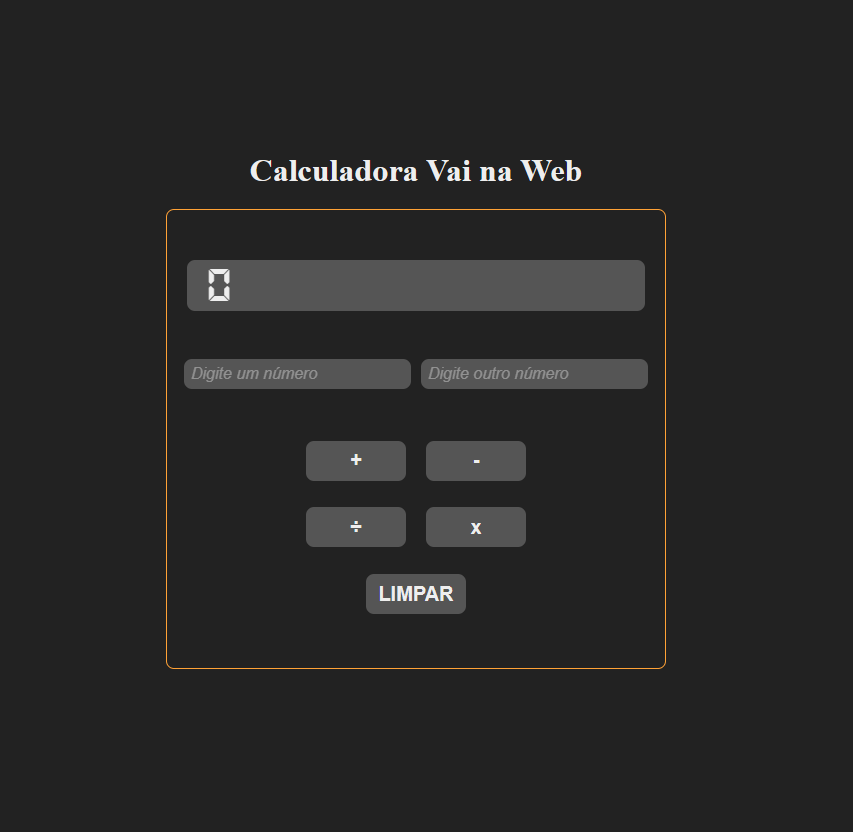

<h1 align="center"> Calculator Challenge </h1>

  <a href="#-tecnologias">Tecnologias</a>&nbsp;&nbsp;&nbsp;|&nbsp;&nbsp;&nbsp;
  <a href="#-projeto">Projeto</a>&nbsp;&nbsp;&nbsp;|&nbsp;&nbsp;&nbsp;  
  <a href="#memo-licença">Licença</a>

  

 

  

## 🚀 Tecnologias

Esse projeto foi desenvolvido com as seguintes tecnologias:

- HTML 
- CSS
- JavaScript
- Git e Github
- React
- Styled Components

## 💻 Projeto

O Desafio da Calculadora foi proposto pelo curso Vai na Web, com o propósito de aplicar os conceitos aprendidos em React. Neste desafio foi aplicado o uso de Hooks, Componentes e Styled-Components.

- [Visite o projeto online](https://ollieveira.github.io/calculator-react-project/)

## :memo: Licença

Esse projeto está sob a licença MIT.

---
